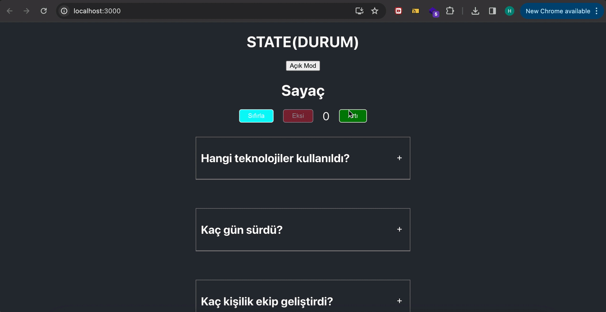

<h1> React State </h1>

Basics of React State

<h2> Overview </h2>

We have learned the basics of how to use state, how it emerged in the first place and how useState functions.

<h2> Technologies Used </h2>

<ul>

<li> CSS </li>  

<li> Javascript </li>  

<li> React </li>  

</ul>

<h2> Screen gif </h2>

